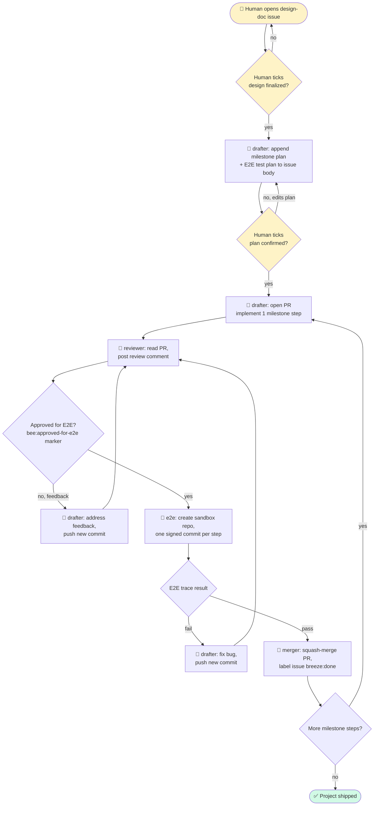

# git-bee

*(call it **bee**)*

An autonomous agent that buzzes through GitHub issues on a schedule, picks up unfinished work, and ships it while you're not watching.

## How it works



*Legend: 👤 = human action · 🐝 = autonomous agent step · ⬜ = decision gate*

In prose:

1. You open a **design-doc issue** describing what you want built, tick its finalization checkbox when the design is ready.
2. The `drafter` agent drafts a milestone plan (one PR per step) and E2E test plan inside the issue body. You tick its plan-confirmation checkbox.
3. For each milestone step, the `drafter` opens a PR. The `reviewer` reads it; if approved, the `e2e` agent runs the PR in a sandbox repo where every step is a signed commit (git log = test trace). The `merger` squash-merges and labels the original issue `breeze:done`.
4. A cron (launchd) fires `scripts/tick.sh` every few minutes — but only as a *watchdog*. Each agent exit lets the next role pick up on the next tick; the cron's job is to wake things up if they stall.
5. If an agent can't proceed (ambiguous spec, flaky test, unresolvable conflict), it tags `breeze:human` on the item and pauses. You see `⚠ N paused` in the statusline; nothing moves until you intervene.
6. When no open items remain, the bee is idle. The project is shipped.

## Labels

Only three, matching the breeze/gardener convention. No `breeze:new` — absence of any label on an open item means "unclaimed, fair game."

| Label | Meaning | Who sets |
|---|---|---|
| `breeze:wip` | An agent has claimed this item | The claiming agent (paired with a `<!-- breeze:claimed-at=... -->` comment) |
| `breeze:done` | All work for this item is complete | The agent, when closing |
| `breeze:human` | Agent gave up after N attempts, needs human | The responder agent, per breeze#12 convention (N=5) |

Stale `breeze:wip` = timestamp older than 2 hours. Any agent may take over a stale claim.

## Agent roles

- [`agents/drafter.md`](agents/drafter.md) — Reads a design-doc issue, drafts the design in comments, opens implementation PRs linked with `Fixes #<issue>`. Also addresses reviewer feedback.
- [`agents/reviewer.md`](agents/reviewer.md) — Reviews implementation PRs. Normal prose review comments. Focus: does the code match the design, security, obvious implementation issues.
- [`agents/e2e.md`](agents/e2e.md) — Runs E2E for a PR in a sandbox repo. Commits each step as its own commit; the Git log is the test trace.
- [`agents/merger.md`](agents/merger.md) — Merges approved PRs with passing E2E; closes linked issues with `breeze:done`.

## Cron

`launchd/com.serenakeyitan.git-bee.plist` — installs `scripts/tick.sh` as a launch agent. Default interval is 5 minutes; tune via the plist's `StartInterval` key. Install with:

```bash
cp launchd/com.serenakeyitan.git-bee.plist ~/Library/LaunchAgents/
launchctl load ~/Library/LaunchAgents/com.serenakeyitan.git-bee.plist
```

Uninstall with `launchctl unload ...`.

## Status

Early. See [issue #1](https://github.com/serenakeyitan/git-bee/issues/1) — the bootstrap design doc.
