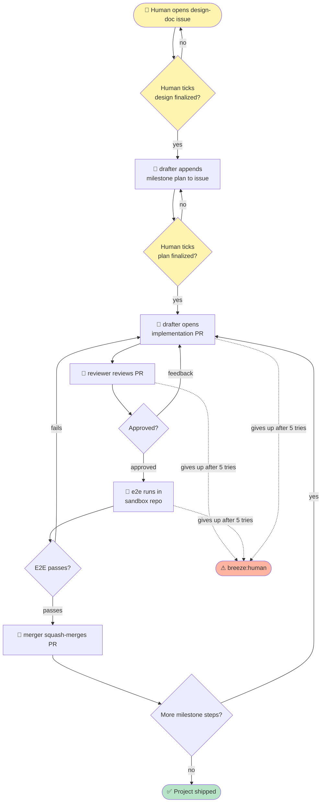

# git-bee

*(call it **bee**)*

An autonomous agent that buzzes through GitHub issues on a schedule, picks up unfinished work, and ships it while you're not watching.

## Flow



## How it works

1. You open a **design-doc issue** describing what you want built; tick the "design finalized" checkbox when ready.
2. A cron (launchd) fires `scripts/tick.sh` every 5 minutes (default).
3. The tick checks: is an agent already running locally? If yes, exit.
4. Otherwise it scans the repo for open issues/PRs without a fresh `breeze:wip` claim and picks the oldest one.
5. It claims the item (adds `breeze:wip` label), spawns an agent, and exits.
6. The agent works the item to completion, then removes its claim.
7. When nothing is left open, the tick exits quietly. The project is finalized.

## Labels

Only three, matching the breeze/gardener convention. No `breeze:new` — absence of any label on an open item means "unclaimed, fair game."

| Label | Meaning | Who sets |
|---|---|---|
| `breeze:wip` | An agent has claimed this item | The claiming agent |
| `breeze:done` | All work for this item is complete | The agent, when closing |
| `breeze:human` | Agent gave up after N attempts, needs human | The responder agent, per breeze#12 convention (N=5) |

Stale `breeze:wip` = labeled event timestamp older than 2 hours. Any agent may take over a stale claim.

To prevent label churn, `breeze:wip` is kept when agents hand off work. The next agent refreshes the claim without removing/re-adding the label.

## Agent roles

- [`agents/drafter.md`](agents/drafter.md) — Reads a design-doc issue, drafts the design in comments, opens implementation PRs linked with `Fixes #<issue>`. Also addresses reviewer feedback.
- [`agents/reviewer.md`](agents/reviewer.md) — Reviews implementation PRs. Normal prose review comments. Focus: does the code match the design, security, obvious implementation issues.
- [`agents/e2e.md`](agents/e2e.md) — Runs E2E for a PR in a sandbox repo. Commits each step as its own commit; the Git log is the test trace.
- [`agents/merger.md`](agents/merger.md) — Merges approved PRs with passing E2E; closes linked issues with `breeze:done`.

## Cron

`launchd/com.serenakeyitan.git-bee.plist` — installs `scripts/tick.sh` as a 5-minute launch agent (default). Install with:

```bash
cp launchd/com.serenakeyitan.git-bee.plist ~/Library/LaunchAgents/
launchctl load ~/Library/LaunchAgents/com.serenakeyitan.git-bee.plist
```

Uninstall with `launchctl unload ...`.

## Status

Early. See [issue #1](https://github.com/serenakeyitan/git-bee/issues/1) — the bootstrap design doc.
